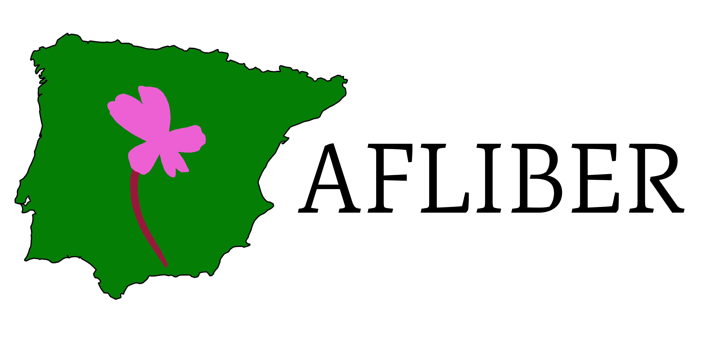
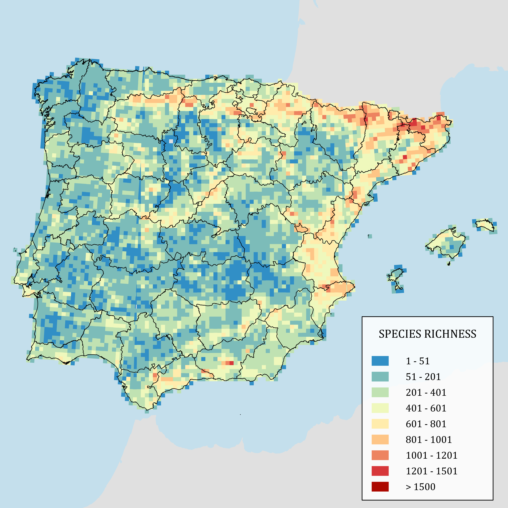
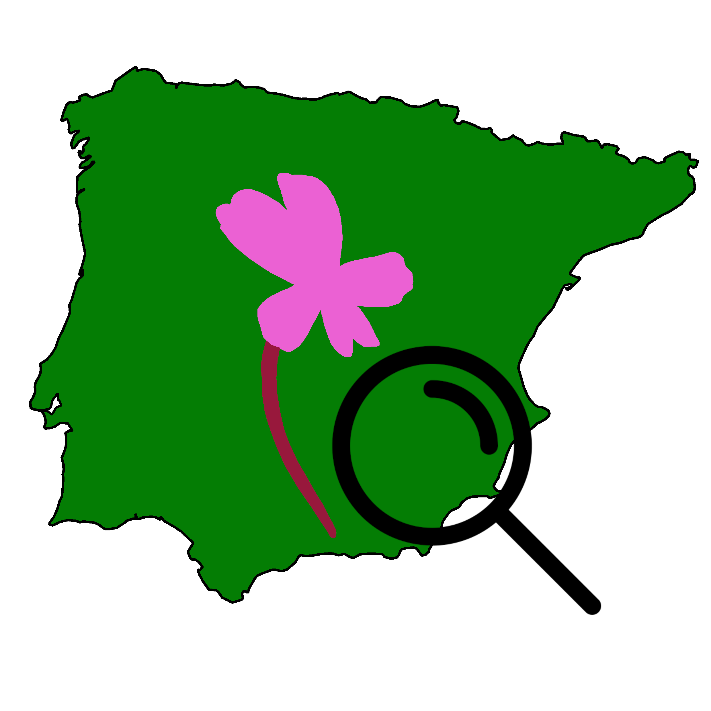

::::::: center-all
{width="35%"} 
  
<!-- [ AFLIBER ]{style="font-size: 2.5rem;"} -->
<!--    -->
[ Atlas of the Flora Iberica database]{style="font-size: 1.5rem;"}
    

:::::: columns
::: {.column width="35%"}
 Read the compilation process of the dataset at [Global Ecology and Biogeography](https://doi.org/10.1111/geb.13363)
:::

::: {.column width="10%"}
<!-- empty column to create gap -->
:::

::: {.column width="35%"}

Visualize and download AFLIBER data interactively at the [AFLIBER Shinyapp](https://afliber.shinyapps.io/afliber)
:::
::::::

  
To access the dataset head to [Dryad Digital Repository](https://doi.org/10.5061/dryad.gmsbcc2kv)
:::::::
